# Port of Bordeaux - Bassens terminal vessel calls
In this notebook, EDA work on vessel calls data from GPMB is presented. 8 years of vessel calls data was acquired, from the beginning of 2010 to the end of 2017. The data contains information about almost 4500 arrivals of cargo vessels and tankers. Even though GPMB has 7 terminals, all data is from one of them, Bassens. It is the largest terminal and capable of processing (loading and unloading) different types of cargo, bulk goods, cereals, containers, forestry products and heavy lift cargo. In the notebook, visualizations are presented, that provide insight in yearly trends of the number of arriving vessels and amount of processed cargo, seasonality of cargo types, regular vessels, turnaround time distributions and factors influencing on it (for example, tides).

This report was compiled by XLAB and is based on port call data from Port of Bordeaux - Bassens terminal provided by GPMB and CATIE in the frame of the H2020 PIXEL project.

Names of ships are anonymized.

## Table of Contents

*   [1  Data](#Data)
*   [2  Basic statistics of Port of Bordeaux - Bassens terminal](#Basic-statistics-of-Port-of-Bordeaux---Bassens-terminal)
    *   [2.1  Ship type](#Ship-type)
    *   [2.2  Unloading/Loading cargo](#Unloading/Loading-cargo)
*   [3  Vessels turnarround time](#Vessels-turnarround-time)
    *   [3.1  Distribution of turnaround time](#Distribution-of-turnaround-time)
    *   [3.2  Impact of tide on vessels turnaround time](#Impact-of-tide-on-vessels-turnaround-time)
    *   [3.3  Entry day](#Entry-day)
    *   [3.4  By indiviudal ship - ship name](#By-indiviudal-ship---ship-name)
*   [4  Cargo](#Cargo)
    *   [4.1  Cargo type histogram](#Cargo-type-histogram)
    *   [4.2  Ship tonnage distribution](#Ship-tonnage-distribution)
    *   [4.3  Cargo type per vessel](#Cargo-type-per-vessel)
    *   [4.4  Cargo seasonality](#Cargo-seasonality)

## Data

Data sample:

<table class="dataframe" border="1">

<thead>

<tr style="text-align: right;">

<th></th>

<th>ship_name</th>

<th>cargo_type_in</th>

<th>ship_type</th>

<th>ship_type_fiscal_in</th>

<th>cargo_type_out</th>

<th>ship_type_fiscal_out</th>

<th>date_entry</th>

<th>date_exit</th>

<th>tonnage_entry</th>

<th>tonnage_exit</th>

</tr>

</thead>

<tbody>

<tr>

<th>0</th>

<td>ship_1306</td>

<td>NODATA</td>

<td>CARGO DE PLUS DE 500 TJB</td>

<td>SOL.V</td>

<td>MAIS VRAC</td>

<td>SOL.V</td>

<td>2010-01-01 17:15:00</td>

<td>2010-01-04 19:57:00</td>

<td>0</td>

<td>4370.0</td>

</tr>

<tr>

<th>1</th>

<td>ship_138</td>

<td>UREE VRAC</td>

<td>CARGO DE PLUS DE 500 TJB</td>

<td>SOL.V</td>

<td>TRTX TOURNESOL</td>

<td>SOL.V</td>

<td>2010-01-02 05:20:00</td>

<td>2010-01-15 20:50:00</td>

<td>2344</td>

<td>3294.0</td>

</tr>

<tr>

<th>2</th>

<td>ship_1328</td>

<td>HUILE COLZA</td>

<td>PRODUITS CHIMIQUES (CHEMICAL)</td>

<td>LIQ.V</td>

<td>HUILE COLZA</td>

<td>LIQ.V</td>

<td>2010-01-02 19:00:00</td>

<td>2010-01-08 23:35:00</td>

<td>2999</td>

<td>3000.0</td>

</tr>

<tr>

<th>3</th>

<td>ship_843</td>

<td>METHANOL</td>

<td>PRODUITS CHIMIQUES (CHEMICAL)</td>

<td>LIQ.V</td>

<td>NODATA</td>

<td>LIQ.V</td>

<td>2010-01-02 19:25:00</td>

<td>2010-01-03 19:00:00</td>

<td>3432</td>

<td>0.0</td>

</tr>

<tr>

<th>4</th>

<td>ship_143</td>

<td>UREE VRAC</td>

<td>CARGO DE PLUS DE 500 TJB</td>

<td>SOL.V</td>

<td>MAIS VRAC</td>

<td>SOL.V</td>

<td>2010-01-03 07:55:00</td>

<td>2010-01-07 12:10:00</td>

<td>4123</td>

<td>4151.0</td>

</tr>

</tbody>

</table>

Our data set contains 4497 vessel calls for 8 years, from 2010 to 2017.

<table class="dataframe" border="1">

<thead>

<tr style="text-align: right;">

<th></th>

<th>date_entry</th>

<th>date_exit</th>

</tr>

</thead>

<tbody>

<tr>

<th>count</th>

<td>4497</td>

<td>4497</td>

</tr>

<tr>

<th>unique</th>

<td>4489</td>

<td>4487</td>

</tr>

<tr>

<th>top</th>

<td>2013-07-17 00:01:00</td>

<td>2012-10-24 15:00:00</td>

</tr>

<tr>

<th>freq</th>

<td>2</td>

<td>2</td>

</tr>

<tr>

<th>first</th>

<td>2010-01-01 17:15:00</td>

<td>2010-01-03 19:00:00</td>

</tr>

<tr>

<th>last</th>

<td>2017-12-27 14:50:00</td>

<td>2017-12-29 03:05:00</td>

</tr>

</tbody>

</table>

<pre>Number of vessels that arrived in the port:  4497
Turnaround time - Mean: 53.542, std: 60.073

Above the mean for more than ...
1 std (113.615): 395 (0.088 %) 
2 std (173.688): 160 (0.036 %) 
3 std (233.761): 95 (0.021 %) 

</pre>

## Basic statistics of Port of Bordeaux - Bassens terminal

On the chart below you can see moving average of vessel arrivals count per month with window of 12 months. It decreased from 50 to 40 arrivals per month.

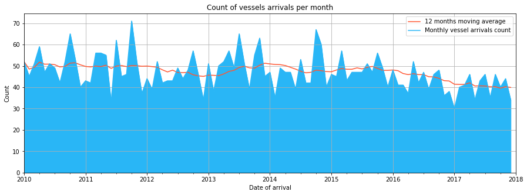

Although, on average, the tonnage of cargo on each ship increased for a bit, the total amount of the cargo per month was reduced.

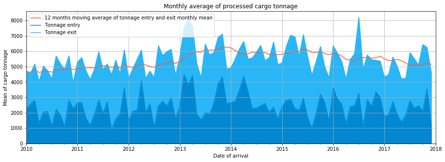

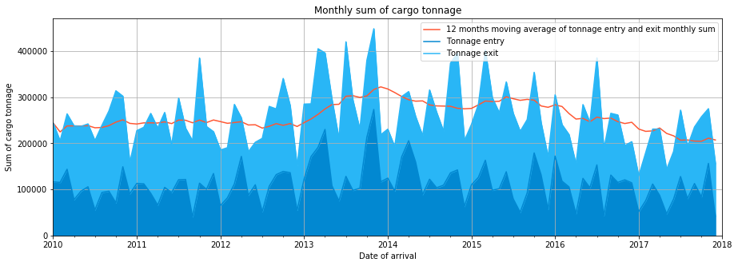

The average turnaround time remained basically same over the years, with some temporary peaks (especially in 2011).

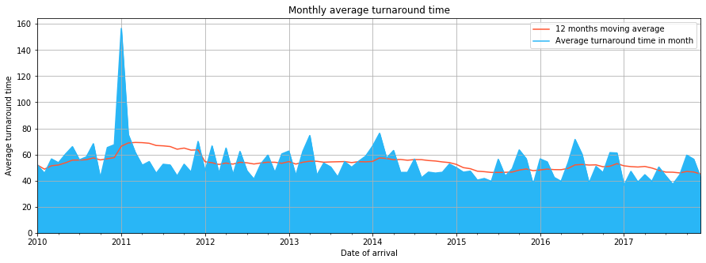

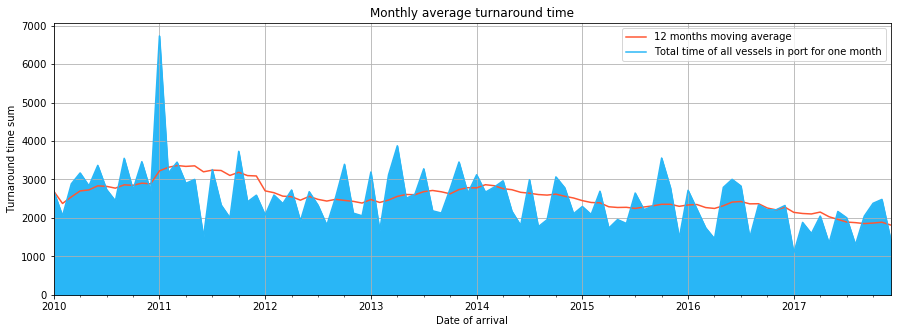

### Ship type

Ship types histogram is plotted below.

### Unloading/Loading cargo

The two charts below are displaying counts of vessels based on cargo operations - if port had to unload and load cargo, if they had to do only one cargo operation type, or none of them.

*   3125 loads
*   2215 unloads

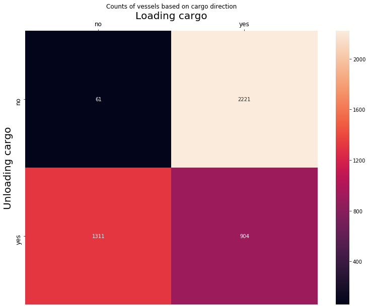

The chart below enhances the chart above with additional information. It also shows most frequent ship types for each combination of cargo operations.

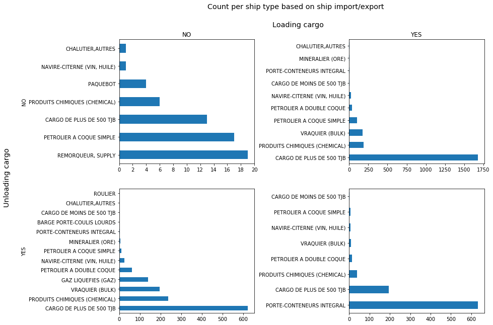

Turnaround time based on cargo operations. It is intresting, that vessels with only unloadings were in average in port for more time than vessels when they had to unload and load cargo. This is probably due to cargo type.

Box plot for tonnage of transported cargo grouped by cargo operations:

*   loading cargo
*   unloading cargo
*   unloading and loading cargo

## Vessels turnarround time

In the table below you can see basic statistics of turnaround time (hours_stay). Average time that vessels stays in port is 53.5 hours with std of 60 hours. Minimum turnaround time in dataset is 0 and maximum is 964\. Both porbably beacuse of error in data or due to extraordinary events.

<table class="dataframe" border="1">

<thead>

<tr style="text-align: right;">

<th></th>

<th>hours_stay</th>

</tr>

</thead>

<tbody>

<tr>

<th>mean</th>

<td>53.541824</td>

</tr>

<tr>

<th>std</th>

<td>60.072959</td>

</tr>

<tr>

<th>min</th>

<td>0.000000</td>

</tr>

<tr>

<th>max</th>

<td>964.950000</td>

</tr>

<tr>

<th>median</th>

<td>35.933333</td>

</tr>

</tbody>

</table>

### Distribution of turnaround time

Turnaround histogram is rising from 0 hours to 25 hours and then starts decreasing. Dips in turnaround time distribution are occuring due to tides. Most of the vessels stay for more than 1 day.

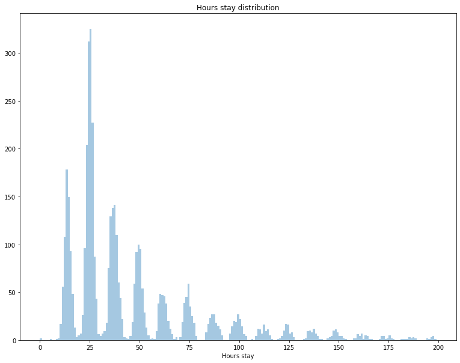

### Impact of tide on vessels turnaround time

Vessels have to take tides into account when arriving or departuring from the Bassens terminal. On the chart below we can see distribution of tide water height in Bassens when vessels arrived and when they departured from the port.

Black line on the chart below represents tide water height. Green dots are representing vessels entries and red dots are representing vessels exits.

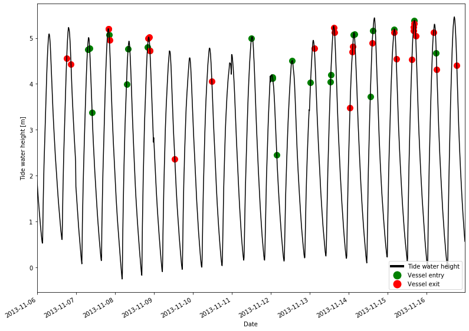

### Entry day

Arrival day of the week has significant impact on turnaround time. Median turnaround time for vessels arriving on saturday is almost twice as much as for vessels that arrive during the working days.

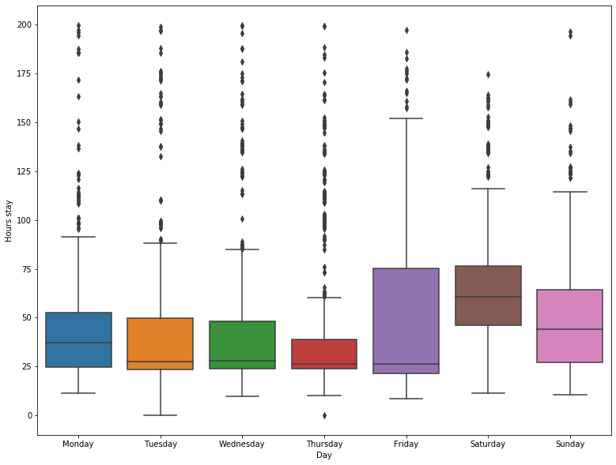

The chart below enhances the chart above with information about holidays. Orange boxes are representing turnaround time distributions for vessels that arrived on holidays and blue boxes for all other arrivals.

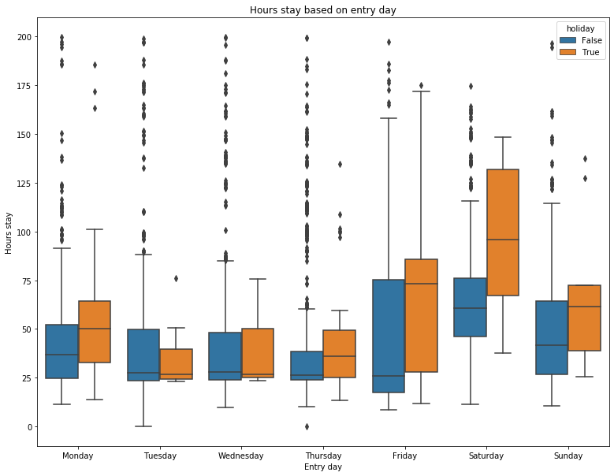

The chart below shows how many vessels enter the port on specific day of week (with blue color) and how many vessels exit the port (with orange color). As expected, very low number of vessels exit port on Sunday.

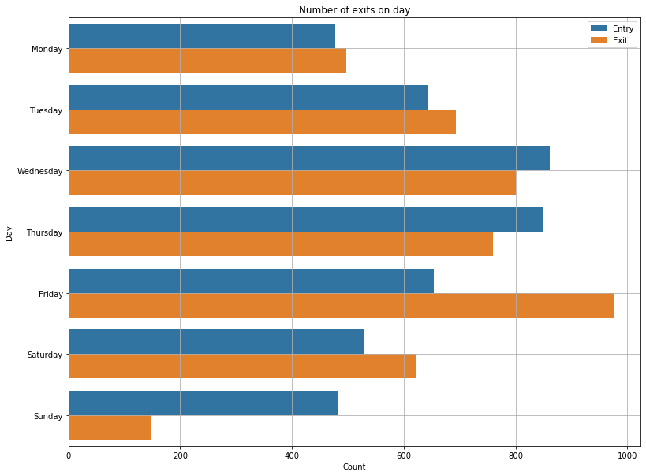

Turnaround time based on vessel type. Some vessels have very low deviation from the median. For example "GAZ LIQUEFIES (GAZ)". Some types have high deviation, for example "VRAQUIER (BULK)". "Remorqueuer, SUPPLY" have even higher, but those vessels doesn't carry any cargo, so we do not take them into account.

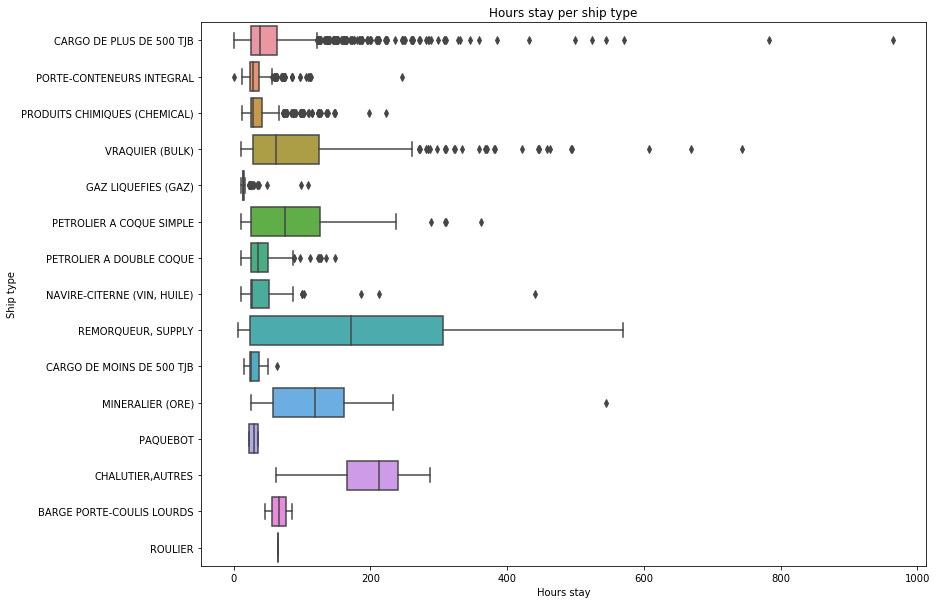

### By indiviudal ship - ship name

Some of the vessels arrive in the port regularly. The table and the box plot below show basic statistics of turnaround time for ships that come to this port most often.

<table class="dataframe" border="1">

<thead>

<tr style="text-align: right;">

<th></th>

<th>count</th>

<th>min</th>

<th>mean</th>

<th>max</th>

<th>median</th>

<th>std</th>

</tr>

<tr>

<th>ship_name</th>

<th></th>

<th></th>

<th></th>

<th></th>

<th></th>

<th></th>

</tr>

</thead>

<tbody>

<tr>

<th>ship_524</th>

<td>136</td>

<td>10.416667</td>

<td>90.326348</td>

<td>362.283333</td>

<td>76.125000</td>

<td>72.005153</td>

</tr>

<tr>

<th>ship_419</th>

<td>130</td>

<td>14.166667</td>

<td>39.198590</td>

<td>245.583333</td>

<td>34.708333</td>

<td>25.433255</td>

</tr>

<tr>

<th>ship_807</th>

<td>107</td>

<td>11.416667</td>

<td>30.057788</td>

<td>75.000000</td>

<td>25.416667</td>

<td>10.157807</td>

</tr>

<tr>

<th>ship_238</th>

<td>62</td>

<td>18.583333</td>

<td>36.160753</td>

<td>112.000000</td>

<td>34.666667</td>

<td>17.547450</td>

</tr>

<tr>

<th>ship_46</th>

<td>54</td>

<td>11.600000</td>

<td>29.627778</td>

<td>53.983333</td>

<td>26.541667</td>

<td>7.767541</td>

</tr>

</tbody>

</table>

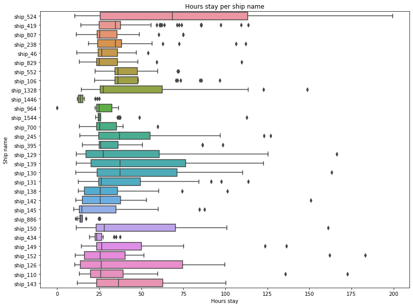

Distribution for vessels with standard deviation of number of days between arrivals less than 20\. Titles of subplots consists of number of vessel's arrivals and its name.

<pre>Cargo types transported by vessels:
Ship name            Cargo types in                      Cargo types out                    
ship_524             NODATA, EMHV - EMAG - FAME          NODATA, EMHV - EMAG - FAME, HUILES MIXTES, BIO-CARBURANTS
ship_419             CONTENEURS, NODATA                  CONTENEURS                         
ship_807             CONTENEURS                          CONTENEURS                         
ship_238             CONTENEURS                          CONTENEURS                         
ship_46              CONTENEURS                          CONTENEURS                         
ship_829             CONTENEURS                          CONTENEURS, NODATA                 
ship_552             CONTENEURS                          CONTENEURS                         
ship_964             CONTENEURS                          CONTENEURS                         
ship_700             CONTENEURS                          CONTENEURS                         
ship_434             CONTENEURS                          CONTENEURS                         
ship_801             BOIS SCIES DU NORD                  NODATA                             
ship_802             CONTENEURS                          CONTENEURS                         
</pre>

The heatmap below shows how many times each vessel arrived in one week. From this heatmap we can see regular lines and seasonality. But bare in mind that this is for all 8 years combined, not only for one. However some ships were comming only in one year. For example "ship_964" was arriving only in 2015.

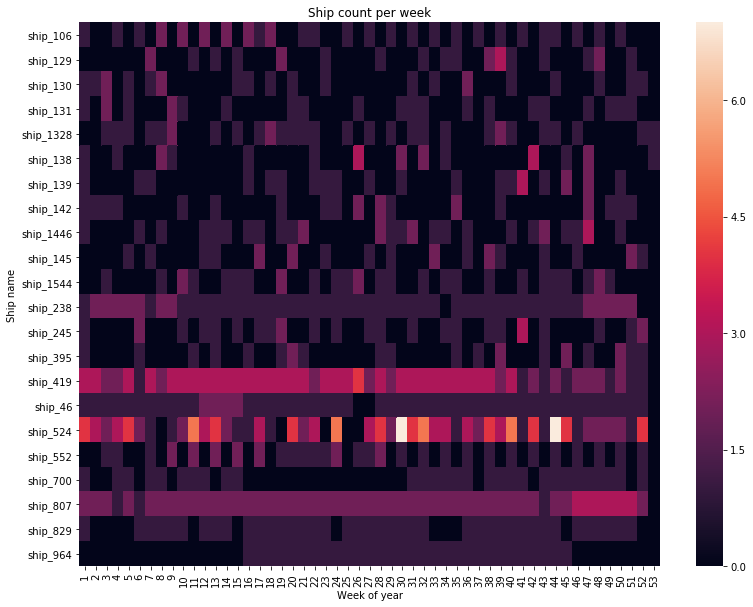

## Cargo

### Cargo type histogram

Histogram of all cargotypes that arrived more than 10 times.

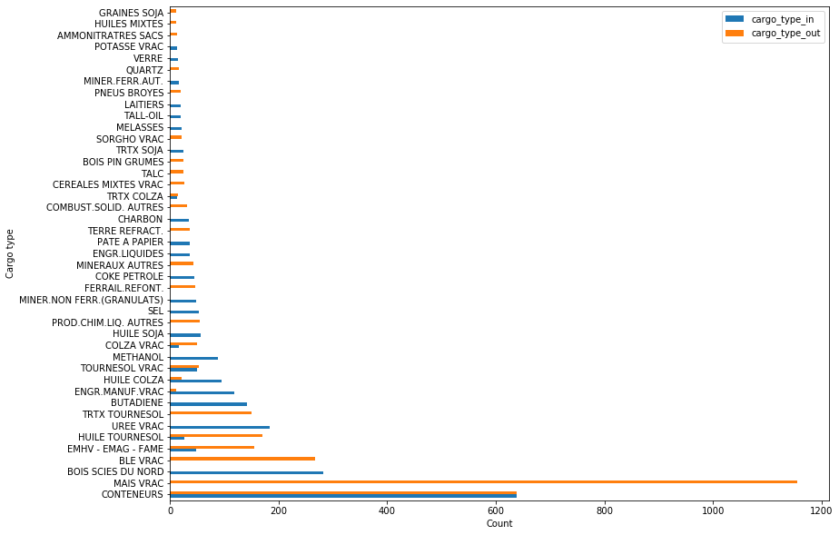

Total tonnage of each cargo type transported is shown on chart below.

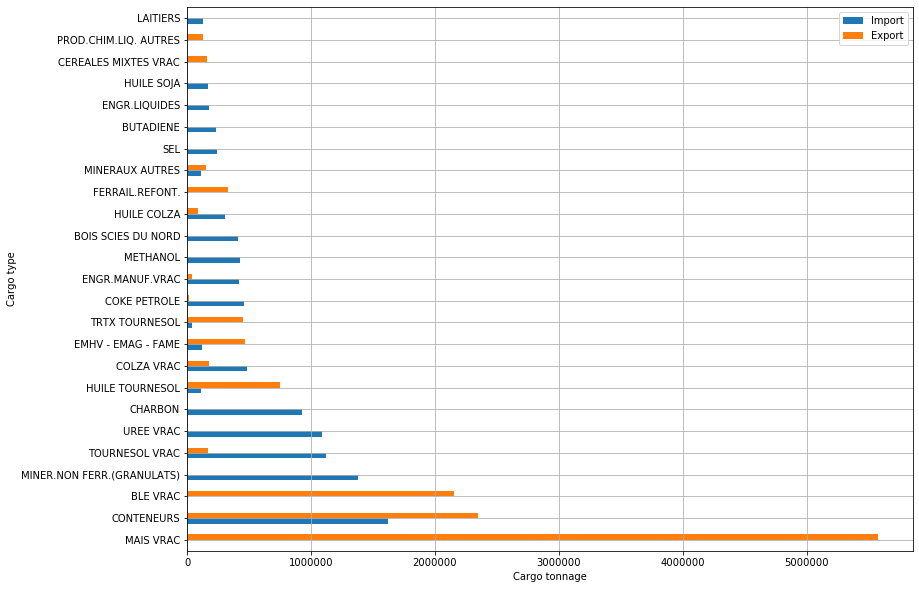

### Ship tonnage distribution

The chart below shows distribution of tonnage entry, tonnage exit or turnaround time for vessels, that arrived in port more than 20 times.

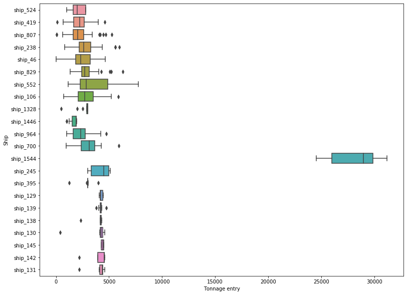

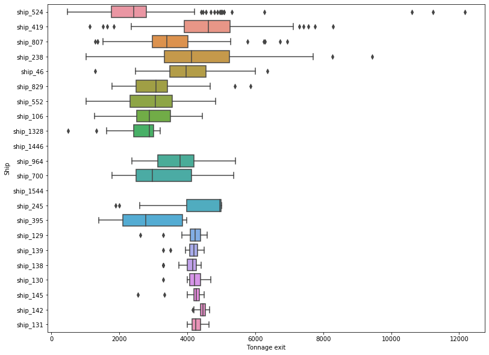

### Cargo type per vessel

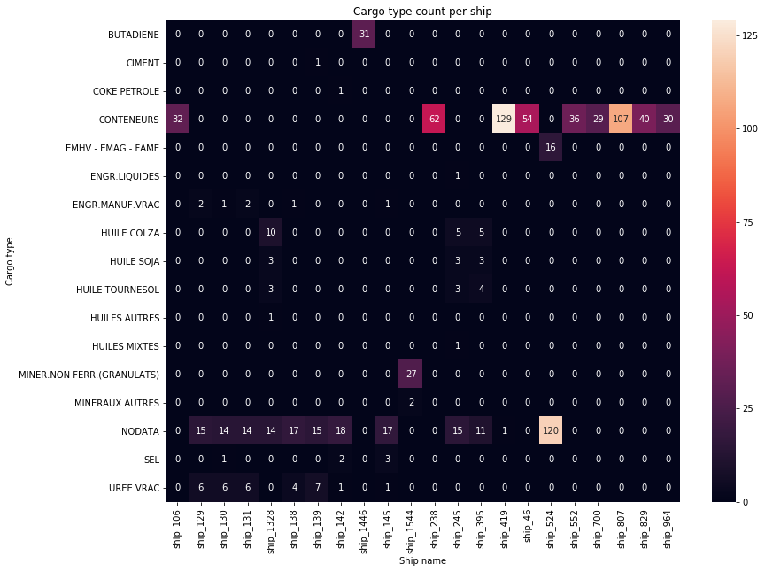

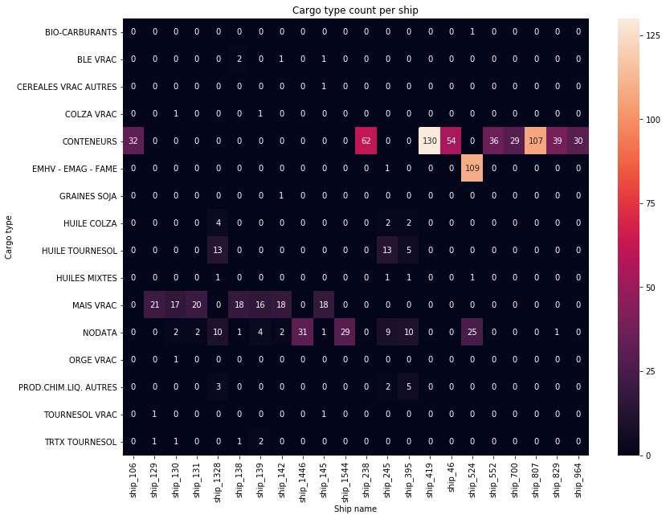

### Cargo seasonality

Next two heatmaps are showing seasonality of cargo types. The first one for import and the second one for export. The x-axis are week of entry for all 8 years. Cargo types are on y-axis. Each cell counts number of arrivals of specific cargo in specific week. Each row is normalized independably. Each cell is devided by row's maximum value.

The chart below shows tonnage sum of imported "URE VRAC" for each month of the year. We can see spike between April and May, and then dip over the summer.

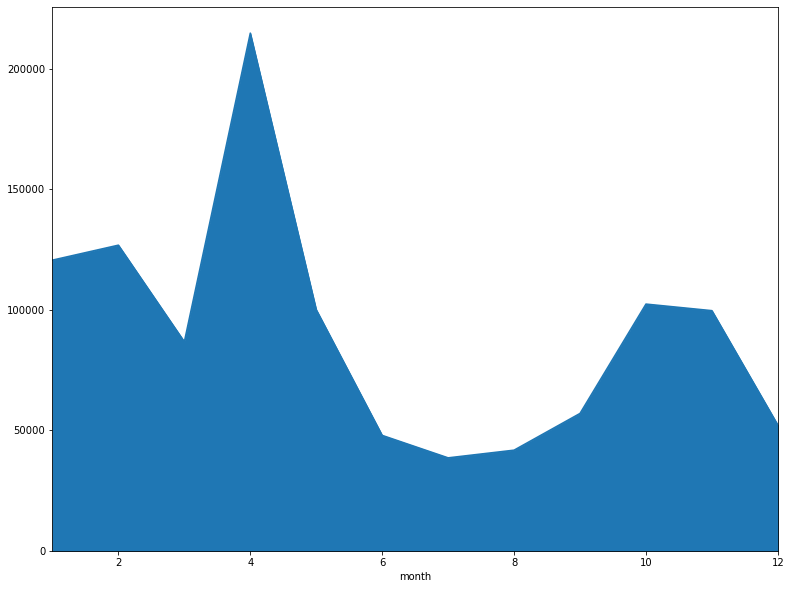

